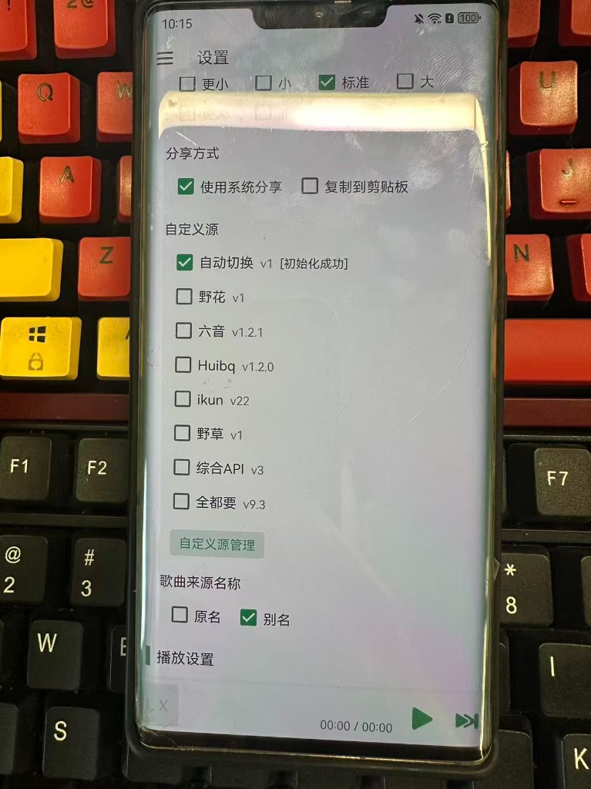

**语言 / Language:** [中文](./README.md) | English

[aiv123.com](https://aiv123.com/) · AI tools directory, 600+ tools in one place

## 🚀 Recommended: [ofox.ai](https://ofox.io/x/aiv123)

> **In short**: One account for the latest GPT / Claude / Gemini and **100+** top models. First top-up gets an extra **$3** credit.

Text, image, video, and embeddings in one place. Caching supported — repeat calls stay cheaper and faster.

[👉 Sign up](https://ofox.io/x/aiv123) · Global dedicated lines · Enterprise SLA · No conversation retention

| ⚡️ Faster & Leaner | 🧠 Models & Modalities | 🛡️ Privacy |
|:---:|:---:|:---:|
| Global lines, enterprise SLA, plus caching | 100+ models · text / image / video / embeddings | No conversation retention |

## ☕ Buy Me a Coke

Open source takes effort — sponsorship is welcome:  
👉 [爱发电 / Afdian](https://ifdian.net/a/shellsec)

---

# Luoxue Music Auto Source

This repository is based on upstream LX Music Mobile ([lx-music-mobile](https://github.com/lyswhut/lx-music-mobile)) **v1.9.1**, keeping the full upstream history, and adds built-in music sources with playback URL failover, plus a few out-of-box default tweaks. This fork is **Luoxue Music Auto Source** — auto sources by name, install-and-play by experience.

> For the full upstream documentation (build notes, contribution guide, license supplement, etc.), see the Chinese [README.md](./README.md). This English file focuses on what this fork adds.

### Install and play

Open the app after install and you’re set: in Settings → Custom Sources, **Auto-switch** is already selected and shows initialization succeeded. Built-in sources — 野花, 六音, Huibq, ikun, 野草, 综合 API, 全都要 — are already in the list. No hunting for scripts, no import step. Song lists (Latest / Hottest) show up right away without configuring sources first. In short: **install and play.**

Settings: Auto-switch is selected and shows initialization succeeded:

Playlists: Latest / Hottest lists show up right away:

## What’s different / Advantages

Compared with official lx-music-mobile v1.9.1:

1. **Multiple built-in music sources** — ready after install; no need to find and import source scripts yourself.
2. **Automatic failover when fetching a play URL fails** — tries built-in sources in order and stops only after all fail.
3. **Default source is auto-switch** (`user_api_auto`).
4. **New installs default to accepting the license agreement**, so the agreement dialog no longer blocks first launch.
5. **No more “beware of scams” tip** dialog.
6. **Cold start does not auto-check official updates**, to avoid upgrading into the stock build and losing these changes. Manual update check in Settings still works.
7. **Defaults enabled**: search hot list, search history, and play-on-list-click.

### Boundaries (to avoid misunderstanding)

- After manually selecting a built-in source, failures still try other built-in sources.
- Empty URLs or non-`http` URLs returned by a script do **not** trigger this failover.
- After a play URL has already been obtained, later 403 / stall issues do **not** go through this failover.
- Notification permission and battery optimization still require user approval in system settings.
- Packages in this repo are signed with the local **debug** keystore; they are not the same package as the official release (hashes differ).

## Version & download

- Based on official **v1.9.1**
- APK file names:
  - `lx-music-mobile-v1.9.1-arm64-v8a.apk`
  - `lx-music-mobile-v1.9.1-armeabi-v7a.apk`
  - `lx-music-mobile-v1.9.1-universal.apk`
  - `lx-music-mobile-v1.9.1-x86.apk`
  - `lx-music-mobile-v1.9.1-x86_64.apk`
- Download: [Releases of this repository](https://github.com/shellsec/lx-music-mobile-auto-source/releases) (APKs are not committed to git; they are attached to GitHub Releases)

FAQ docs from upstream: [Mobile FAQ](https://lyswhut.github.io/lx-music-doc/mobile/faq).

## Upstream project

LX Music Mobile is a React Native music app for Android 5+. Upstream project: https://github.com/lyswhut/lx-music-mobile

Licensed under [Apache License 2.0](./LICENSE) with the upstream supplemental terms described in [README.md](./README.md).
